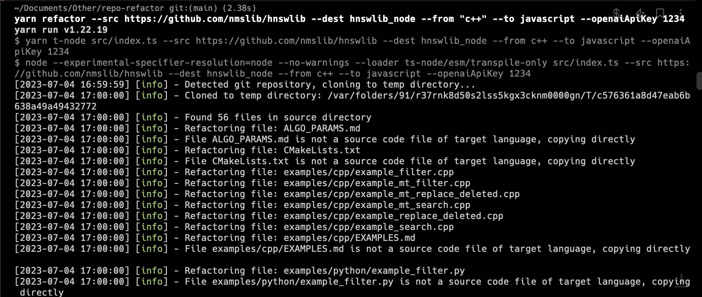

# LLM-based Code Refactoring Tool

This TypeScript program is designed to refactor a library, repo, or directory of code written in one programming language into another programming language using Language Models (LLMs).



## Introduction

This tool uses the OpenAI API, which provides a wide range of pre-trained LLMs for various languages. It also utilizes the [glob](https://github.com/isaacs/node-glob) package to match files and directories. It will do a lot of the initial heavy lifting when translating or refactoring code.

## Installation

To install the required packages, run the following command:

```bash
yarn install
```

## Usage

You will need an OpenAI API key, which can be obtained by signing up for an account [here](https://platform.openai.com/account/api-keys). Once you have an API key, you can set it as an environment variable by running the following command:

```bash
export OPENAI_API_KEY="<key>"
```

You can also pass it to the cli using the `--openaiApiKey` flag

To use the program, simply run the following command:

```bash
yarn refactor --src <source_directory> --dest <destination_directory> --from <source_language> --to <target_language>
```

Here's an example:

```bash
yarn refactor --src ./src --dest ./dist --from python --to javascript
```

This command will refactor all files in the `src` directory that have a `.py` extension into JavaScript files with a `.js` extension, and place the refactored files in the `dist` directory.

## How It Works

The program works by recursively searching the source directory for files with the specified source language extension, and then passing the contents of each file through a pre-trained LLM for the source language.

The refactored code is then written to a file in the destination directory with the specified target language extension. Any non-code files in the source directory are simply copied to the destination directory.

## Known Issues

[ ] The program currently does a poor job of converting files with >7000 tokens, due to the chunking
[ ] The refactoring logic does not currently take into account common package managers - for instance, we should be able to read package.json, understand the dependencies, and lookup equivalents/pass them to the model for the destination language
[ ] When there's a fundamentall different concept in a language that doesn't exist or isn't necessary in another languages (like mutex locks in rust when moving to javascript), it's difficult for the model to omit that code

## Limitations

While this tool can be very useful in automating the refactoring of code from one language to another, it does have its limitations. The accuracy of the refactored code will depend largely on the quality of the pre-trained LLMs used for each language, as well as the complexity of the code being refactored. Additionally, the tool has varying degrees of success in handling any language-specific libraries or dependencies that may be present in the original code.
